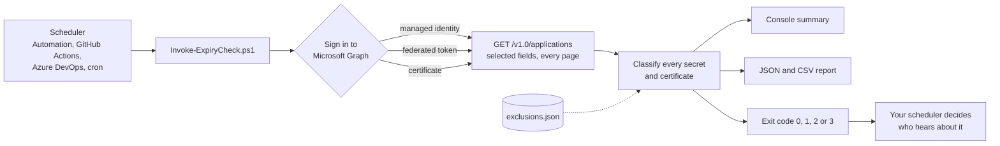

# entra-appreg-expiry-check

A PowerShell tool that finds client secrets and certificates on your Microsoft Entra ID App Registrations that have expired or will expire soon. It reads them with one read-only Microsoft Graph query, prints what needs attention, writes a JSON and CSV report, and exits with a code your scheduler or pipeline can act on.

<!-- diagram: how-it-works.mmd -->


## What it does

- Lists every secret and certificate on every App Registration, including apps that carry several of them, and classifies each one as Expired, Expiring, or Healthy against a threshold you pick.
- Reads each app's owners if you ask, so the report says who to talk to.
- Respects an exclusions file for credentials you've decided to leave alone. Each entry has a reason, and it can have an end date so a temporary exclusion doesn't become permanent.
- Runs unattended with a managed identity, a workload identity federation token, or a certificate. Running the check never needs a client secret of its own.
- Keeps "the check failed" (exit code 1) separate from "the check found something" (2 or 3), so a broken run can't pass for a clean tenant.

It only reads. It needs the `Application.Read.All` Microsoft Graph permission and nothing else, and it never sees secret values, because Microsoft Graph doesn't return them after a secret is created.

## Quick start

You need Windows PowerShell 5.1 or PowerShell 7.2 or later, and the Microsoft Graph authentication module:

```powershell
Install-Module Microsoft.Graph.Authentication -Scope CurrentUser
```

Download or clone this repository, then run the check from its root folder. It opens a browser to sign in:

```powershell
./scripts/Invoke-ExpiryCheck.ps1 -ThresholdDays 30 -IncludeOwners -OutputPath ./report
```

The output looks like this (example data):

```text
Checked 41 credentials across 27 apps. Threshold: 30 days.
Expired: 1   Expiring: 2   Healthy: 36   Excluded: 2

Status   Days App              Type         Name                Expires (UTC)    Owners
------   ---- ---              ----         ----                -------------    ------
Expired   -12 billing-api      ClientSecret prod-2025           2026-09-23 10:00 ana.ruiz@contoso.com
Expiring    7 reporting-worker Certificate  CN=reporting-worker 2026-10-12 12:00 li.wei@contoso.com
Expiring   15 hr-sync          ClientSecret graph-sync          2026-10-20 00:00 deploy-bot

Report written to: ./report/credential-expiry.json, ./report/credential-expiry.csv
```

[Getting started](docs/getting-started.md) walks through the first run, including the consent prompt.

## Exit codes

| Code | Meaning |
| ---- | ------- |
| 0 | Nothing needs attention. |
| 1 | The check itself failed: sign-in, permissions, or a Microsoft Graph error. |
| 2 | At least one credential expires within the threshold. None have expired. |
| 3 | At least one credential has expired. |

Excluded credentials never change the exit code.

## Use it as a module

The script is a thin wrapper. If you'd rather work with the objects directly:

```powershell
Import-Module ./src/EntraAppRegExpiryCheck
Connect-MgGraph -Scopes Application.Read.All

Get-AppCredentialExpiry -ThresholdDays 45 |
    Where-Object { $_.Status -ne 'Healthy' -and -not $_.Excluded } |
    Sort-Object EndDateTime |
    Format-Table Status, DaysRemaining, AppDisplayName, CredentialType, CredentialName, EndDateTime
```

The module exports three functions: `Get-AppCredentialExpiry`, `Measure-AppCredentialExpiry`, and `Export-AppCredentialExpiryReport`. Each has full comment-based help (`Get-Help Get-AppCredentialExpiry -Full`).

## Run it on a schedule

| Where it runs | How it signs in | Example |
| ------------- | --------------- | ------- |
| Azure Automation | Managed identity | [examples/azure-automation](examples/azure-automation) |
| GitHub Actions | Workload identity federation | [examples/github-actions](examples/github-actions) |
| Azure DevOps | Workload identity federation service connection | [examples/azure-devops](examples/azure-devops) |
| Anything else that runs PowerShell | Certificate | [docs/authentication.md](docs/authentication.md#certificate) |

[Scheduling](docs/scheduling.md) compares them, including how each one tells you when a run fails.

## Documentation

- [Getting started](docs/getting-started.md): the first run, start to finish.
- [Authentication](docs/authentication.md): the permission it needs and the four ways to sign in.
- [Configuration](docs/configuration.md): every parameter, and the exclusions file format.
- [Output and exit codes](docs/output-and-exit-codes.md): the record fields, the JSON and CSV layout, and how to consume them.
- [How it works](docs/how-it-works.md): the Graph query, paging, classification, and the edge cases.
- [Scheduling](docs/scheduling.md): where to run it and how you hear about failures.
- [Troubleshooting](docs/troubleshooting.md): the errors people actually hit.
- [What this doesn't solve](docs/production-gaps.md): what's left between this script and a production alerting process.

## What it doesn't do

It tells you what's expiring. It doesn't decide who should hear about each credential, remember what it already told them, notice when a credential gets rotated, or warn you when the scheduled run itself stops running. [What this doesn't solve](docs/production-gaps.md) goes through each of those and what building them involves.

## Repository layout

```text
.
├── src/EntraAppRegExpiryCheck/   The PowerShell module: Public/ and Private/ functions
├── scripts/                      Invoke-ExpiryCheck.ps1, the entry point for people and schedulers
├── examples/                     Azure Automation, GitHub Actions, Azure DevOps, and a sample exclusions file
├── docs/                         The guides, with Mermaid diagram sources in docs/diagrams/
├── tests/                        Pester 5 tests and recorded Graph responses
└── .github/                      CI workflow, issue and pull request templates
```

## Contributing and license

Issues and pull requests are welcome. [CONTRIBUTING.md](CONTRIBUTING.md) explains how to run the tests. Released under the [MIT License](LICENSE).

Maintained by [Maksym Vostruhin](https://www.linkedin.com/in/mvostruhin/), who also builds [Token Watch](https://aztokenwatch.com/), a hosted service for the parts listed in [What this doesn't solve](docs/production-gaps.md).
