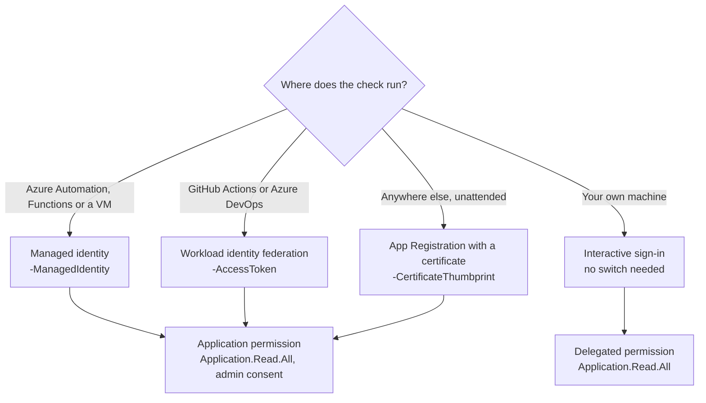

# Authentication

The check needs one Microsoft Graph permission, `Application.Read.All`, and a way to sign in. Which way depends on where it runs.

<!-- diagram: authentication-options.mmd -->


## The permission

`Application.Read.All` lets the check read every App Registration and service principal in the tenant, including credential metadata: names, key IDs, thumbprints, and start and end dates. It can't change anything, and it can't read secret values, which Microsoft Graph only ever returns once, at the moment a secret is created.

Unattended sign-in uses it as an application permission, which an administrator grants once with admin consent. Interactive sign-in uses it as a delegated permission, which also needs admin consent.

### Owners need one more permission

With `-IncludeOwners`, the check also reads each app's owners. Owners are users or service principals, and `Application.Read.All` doesn't cover reading users. Without a user-read permission, Microsoft Graph still returns each owner, but with only its object ID. To get names and email addresses:

- Interactive sign-in requests `User.ReadBasic.All` automatically when you pass `-IncludeOwners`.
- Unattended sign-in needs the `User.Read.All` application permission as well.

The check works either way. Without the extra permission, the owner column shows object IDs.

## Interactive

Run the script with no sign-in switch. It calls `Connect-MgGraph -Scopes Application.Read.All` and a browser window opens. Add `-TenantId` if your account belongs to several tenants.

```powershell
./scripts/Invoke-ExpiryCheck.ps1 -TenantId contoso.onmicrosoft.com
```

## Managed identity

For Azure Automation, Azure Functions, or an Azure VM. Turn on the resource's system-assigned managed identity (or attach a user-assigned one), then give it the Graph permission.

The Entra admin center can't grant Microsoft Graph application permissions to a managed identity, so [Grant-GraphAppRole.ps1](../examples/azure-automation/Grant-GraphAppRole.ps1) does it through Graph. Run it once, as a Privileged Role Administrator or Global Administrator, with the identity's object (principal) ID:

```powershell
./examples/azure-automation/Grant-GraphAppRole.ps1 -PrincipalObjectId <object-id>

# With owner names and email addresses as well:
./examples/azure-automation/Grant-GraphAppRole.ps1 -PrincipalObjectId <object-id> -Permission Application.Read.All, User.Read.All
```

Then:

```powershell
./scripts/Invoke-ExpiryCheck.ps1 -ManagedIdentity
./scripts/Invoke-ExpiryCheck.ps1 -ManagedIdentity -ManagedIdentityClientId <client-id-of-a-user-assigned-identity>
```

The [Azure Automation example](../examples/azure-automation/README.md) covers the whole setup.

## Workload identity federation

For GitHub Actions and Azure DevOps. The pipeline signs in as an App Registration through a federated credential, so no secret or certificate is stored anywhere. The App Registration needs the `Application.Read.All` application permission with admin consent.

Once the pipeline has signed in with the Azure CLI, it asks for a Microsoft Graph token and passes it to the script as a secure string:

```powershell
$token = az account get-access-token --resource-type ms-graph --query accessToken -o tsv |
    ConvertTo-SecureString -AsPlainText -Force
./scripts/Invoke-ExpiryCheck.ps1 -AccessToken $token -OutputPath ./report
```

The `--resource-type ms-graph` part matters. Without it you get a token for Azure Resource Manager, and Graph rejects it.

Step-by-step setup: [GitHub Actions](../examples/github-actions/README.md), [Azure DevOps](../examples/azure-devops/README.md).

## Certificate

For a server, container, or scheduler outside Azure. Create an App Registration, give it the `Application.Read.All` application permission with admin consent, and upload a certificate to it.

On Windows, a self-signed certificate is enough:

```powershell
$cert = New-SelfSignedCertificate -Subject 'CN=entra-appreg-expiry-check' `
    -CertStoreLocation 'Cert:\CurrentUser\My' -KeyExportPolicy NonExportable `
    -KeySpec Signature -NotAfter (Get-Date).AddYears(1)
Export-Certificate -Cert $cert -FilePath ./expiry-check.cer
```

Upload `expiry-check.cer` under the App Registration's Certificates & secrets, then run:

```powershell
./scripts/Invoke-ExpiryCheck.ps1 -TenantId <tenant-id> -ClientId <app-client-id> -CertificateThumbprint $cert.Thumbprint
```

`-CertificateThumbprint` looks the certificate up in the current user's certificate store. On Linux or macOS, it's simpler to load the certificate yourself and reuse the connection:

```powershell
$cert = [System.Security.Cryptography.X509Certificates.X509Certificate2]::new('./expiry-check.pfx', $pfxPassword)
Connect-MgGraph -TenantId <tenant-id> -ClientId <app-client-id> -Certificate $cert -NoWelcome
./scripts/Invoke-ExpiryCheck.ps1 -UseExistingConnection
```

This certificate expires too. Because it lives on an App Registration, the check reports it like any other credential, so make sure the threshold gives you enough time to replace it.

## An existing connection

`-UseExistingConnection` skips sign-in and uses whatever `Connect-MgGraph` session is already open. That covers anything the switches above don't, and the script leaves the session connected when it finishes.

## Why there's no client secret option

A scheduled job that authenticates with a client secret depends on the kind of credential it exists to watch. If that secret expires, the check stops, and nothing tells you. The script doesn't take a secret for that reason. If you have no other choice, connect with `Connect-MgGraph -ClientSecretCredential` yourself and pass `-UseExistingConnection`. Keep that secret out of your exclusions file, so the check at least warns you before its own secret lapses.
