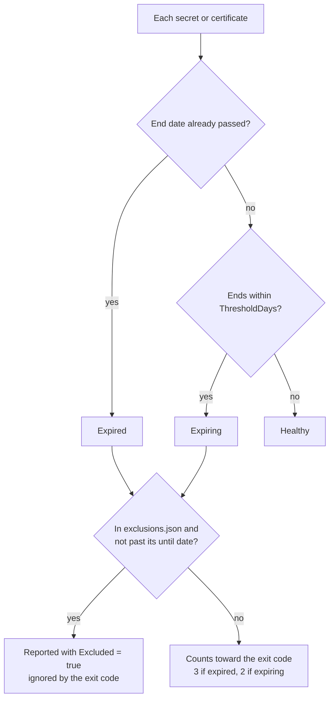

# How it works

## The Graph request

The check makes one request and follows its pages:

```http
GET https://graph.microsoft.com/v1.0/applications?$select=id,appId,displayName,passwordCredentials,keyCredentials&$top=999
```

`$select` keeps each response down to the fields the check uses. `$top=999` asks for the largest page Graph allows for applications; the default is 100. When a response includes `@odata.nextLink`, the check requests that link next, and it stops when a page arrives without one.

With `-IncludeOwners`, the query adds `$expand=owners($select=id,displayName,userPrincipalName,mail)` and leaves the page size at Graph's default. Expanded relationships return at most about 20 items per object and can't be paged, so an app with more than 20 owners shows the first 20.

The Microsoft Graph PowerShell SDK retries throttled requests (HTTP 429) and transient failures (503 and 504) on its own. Any other error stops the run with exit code 1, because a half-read tenant would under-report.

## Why Invoke-MgGraphRequest instead of Get-MgApplication

`Get-MgApplication` from the Microsoft.Graph.Applications module would work too. The check calls the REST API through `Invoke-MgGraphRequest` instead, for two reasons:

- It only needs `Microsoft.Graph.Authentication`, one small module. That makes it quicker to install and import in Azure Automation and on CI runners.
- The response is the Graph API's own JSON, which doesn't change shape between SDK releases.

If you prefer the SDK cmdlet, this is the equivalent request:

```powershell
Get-MgApplication -All -Property id, appId, displayName, passwordCredentials, keyCredentials
```

`-Property` replaces the default set of properties rather than adding to it, so any property you leave out of the list comes back empty. Leaving out `passwordCredentials` is the usual reason a script like this reports that no app has secrets.

## Classification

Every credential gets a status. Excluded credentials keep theirs, but they don't count toward the exit code.

<!-- diagram: credential-classification.mmd -->


All dates are compared in UTC, against the moment the run started. A credential with no end date is reported as `Unknown`. Graph always returns an end date for App Registration credentials, so in practice that status shouldn't appear.

## Certificates

The thumbprint in the report comes from the certificate's `customKeyIdentifier`. For a certificate uploaded through the Entra admin center or Graph, that field holds the SHA-1 thumbprint as base64, and the check turns it into the usual 40-character hex string. Some tools set their own identifier instead; when it isn't 20 bytes long, the thumbprint is left empty.

A certificate stored together with its private key appears twice in `keyCredentials`, once with usage `Sign` and once with usage `Verify`, with the same identifier and dates. Entra does this for SAML signing certificates. The check reports the `Verify` entry only, so each certificate is counted once.

## Service principals

Credentials can also be added directly to a service principal (an Enterprise application), where they don't show up on any App Registration. `-IncludeServicePrincipals` reads those as well, from `/v1.0/servicePrincipals` with the same fields plus `servicePrincipalType`. What tends to turn up:

- SAML signing certificates for single sign-on apps. Entra stores a password credential alongside each one, with the same dates, so each SAML certificate appears as one certificate and one client secret in the report. Entra already emails the notification addresses configured on the app 60, 30, and 7 days before a SAML signing certificate expires; this report puts them next to everything else.
- Secrets or certificates someone added to a service principal with Graph or PowerShell.

Managed identities are skipped, because Azure rotates their credentials itself. Service principals for multitenant apps published by other organizations normally carry no credentials in your tenant; theirs live in the publisher's tenant.

Tenants usually have far more service principals than App Registrations, since every Microsoft and third-party app in use has one, so this option makes the run slower.

## Owners

`Owners` lists the users and service principals in the app's Owners list, up to about 20. Without a user-read permission, Graph returns them with only an object ID (see [Authentication](authentication.md#owners-need-one-more-permission)).

The Owners list is where Entra records who can manage an app, which isn't always the person who should hear about an expiring credential. Owners leave, plenty of apps have none, and some are owned by a service principal. [What this doesn't solve](production-gaps.md#owner-routing-and-a-fallback) has more on that.

## What it never reads or changes

- Secret values. Graph returns a secret's value only in the response that creates it.
- Private keys. The check doesn't request the certificate `key` property, and private keys are never stored on an App Registration in the first place.
- Anything else in the directory: users beyond the owner fields above, groups, sign-in logs.

It sends only GET requests. Nothing in the module or the script writes to the tenant.
