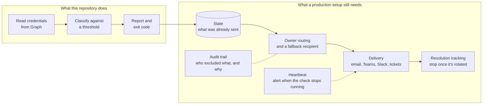

# What this doesn't solve

The script answers one question: which credentials have expired or are about to, right now. Getting each of those credentials rotated before it breaks something takes more than that answer. This page lists what's missing, so you can decide what to build, what to accept, and what to leave.

<!-- diagram: production-gaps.mmd -->

For one admin and a few dozen apps, a failed pipeline email may be all you need. The gaps below start to matter as the number of apps, teams, and people grows.

## Delivery

An exit code and a report file aren't a message to anyone. The examples rely on the scheduler's own failure notification, which reaches whoever owns the pipeline, not whoever owns the app. Sending email, a Teams or Slack message, or a ticket means more code: a mail-sending permission or a webhook, message formatting, and handling for when delivery fails. Posting into Teams now goes through a Power Automate workflow, since the older Office 365 connectors are being retired.

## Owner routing and a fallback

The report lists each app's owners, but the Owners list in Entra records who can manage an app, which isn't always who should be told. People leave and stay listed. Many apps have no owners at all, and some are owned by a service principal. A working setup maps apps to teams and has a fallback recipient for apps nobody claims.

## State and repeat alerts

Every run starts from nothing. With a 30-day threshold, a daily run reports the same credential 30 times. That's either noise or exactly what you want, but deciding needs state: what was sent, to whom, and when, kept somewhere between runs (a storage table, a blob, a database), plus rules for when to repeat and when to escalate.

## Resolution tracking

Adding a new secret doesn't remove the old one, so the check keeps reporting the expiring credential until someone deletes it. If alerts open tickets, something has to notice that a newer credential exists, that the old one is no longer used, and then close the ticket. Otherwise people learn to ignore the alerts.

## Exclusions as a process

A JSON file in a repository works while one team owns it. With more teams you'll want to know who excluded what and why, when each exclusion gets reviewed, and how to stop someone from excluding an app they don't own. That's access control and an audit trail, and the script has neither.

## Monitoring the monitor

Exit code 1 covers a run that fails. A run that never starts produces nothing at all, and nothing looks the same as a healthy tenant. Schedules expire, workflows get disabled, service connections get deleted, and the check's own credential expires. A heartbeat that alerts when there hasn't been a successful run in the last day closes that gap, and it's easy to forget.

## Keeping it running

Microsoft Graph, the PowerShell modules, and CI runner images change over time. Someone has to own the script: update it, fix it when a run breaks, and still be around next year when the person who set it up has moved on.

## If you'd rather not build this

[Token Watch](https://aztokenwatch.com/) is a hosted service, made by the maintainer of this repository, that covers most of this list. It reads App Registration secrets and certificates with read-only Graph access, keeps an audit history of who changed what, and sends email alerts on every plan, including the free one. Paid plans add owner notifications and alerts that repeat until a credential is rotated, and the Team plan adds one more channel: Slack, Microsoft Teams, Azure DevOps work items, or a signed webhook. This script stays useful next to it as an independent cross-check, or as everything you need if your tenant is small.
