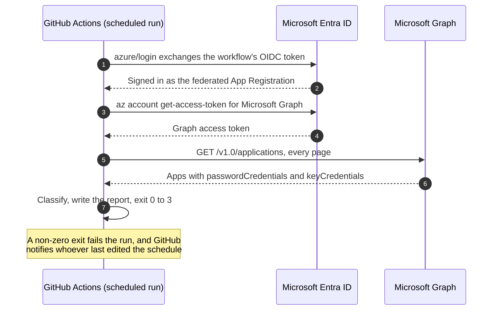

# Scheduling

One run tells you where the tenant stands today. To protect you, the check has to run by itself, and a failing run has to reach a person.

## Where to run it

| Platform | Sign-in | How a failing run reaches you | Watch out for |
| -------- | ------- | ----------------------------- | ------------- |
| [Azure Automation](../examples/azure-automation/README.md) | Managed identity | The job ends as Failed. Add an Azure Monitor alert on failed jobs. | Automation schedules have an optional expiry date. Leave it unset. |
| [GitHub Actions](../examples/github-actions/README.md) | Workload identity federation | The run fails, and GitHub emails whoever last edited the workflow's `cron` line. | In a public repository, GitHub disables scheduled workflows after 60 days with no repository activity. |
| [Azure DevOps](../examples/azure-devops/README.md) | Workload identity federation service connection | The run fails. Nobody requested a scheduled run, so add a notification subscription for failed builds of this pipeline. | Without `always: true`, a schedule only runs when the branch has changed since the last scheduled run. |
| cron, Task Scheduler, a container | Certificate | Whatever you attach to the exit code. | The host itself: patching, reboots, and the certificate's own expiry. |

## How often

Daily is enough. Credentials expire on a date, not within minutes, and a daily run with a sensible threshold gives you weeks of notice. Running more often adds noise without adding warning time.

If you run less often, raise the threshold to match. [Configuration](configuration.md#choosing-a-threshold) has a rule of thumb.

## Making failures visible

The exit codes separate three situations, and each deserves a different response:

- 2 or 3: the check worked and found something. Someone should rotate a credential.
- 1: the check didn't work. Someone should fix the check, because right now nobody knows the state of the tenant.
- No run at all: nothing happens, which looks exactly like a clean tenant.

The last one is the hard one. A schedule that stops firing, a disabled workflow, a deleted service connection, or the check's own certificate expiring all produce silence. Each example's README shows one way to alert when there hasn't been a successful run in the last day. [What this doesn't solve](production-gaps.md#monitoring-the-monitor) covers the problem in general.

## A GitHub Actions run, start to finish

<!-- diagram: github-actions-run.mmd -->

