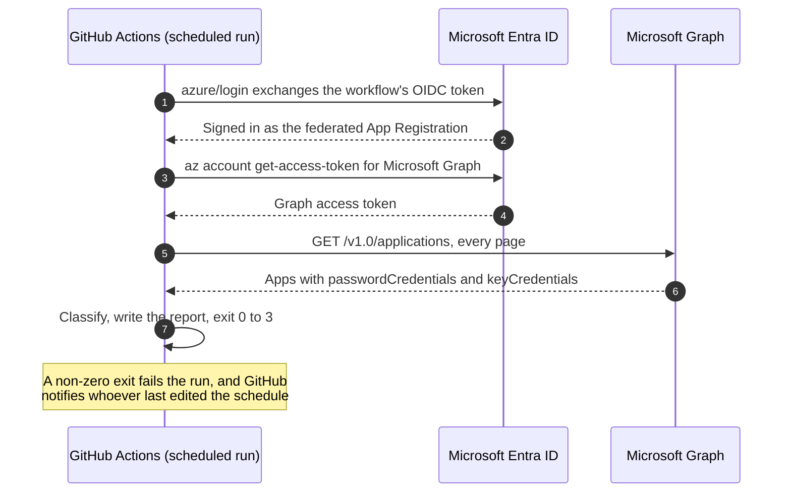

# GitHub Actions

Runs the check every morning on a GitHub-hosted runner. The workflow signs in through workload identity federation, so no secret or certificate is stored in GitHub.

<!-- diagram: github-actions-run.mmd -->


## Setup

### 1. Put the code in a repository

Fork this repository, or copy `src/` and `scripts/` into a repository of your own. A private repository is the better home: the run summary and the report list your app names.

### 2. Create an App Registration for the workflow

In the Entra admin center, create an App Registration (single tenant is fine). Then:

- Under Certificates & secrets, open Federated credentials and add one for the scenario "GitHub Actions deploying Azure resources". Enter your organization and repository, choose entity type Branch, and enter your default branch. Scheduled runs always use the default branch.
- Under API permissions, add the Microsoft Graph application permission `Application.Read.All` and grant admin consent. Add `User.Read.All` too if you plan to pass `-IncludeOwners`.

### 3. Add two repository variables

In the repository, open Settings, then Secrets and variables, then Actions, and add these as variables. Neither value is secret.

| Variable | Value |
| -------- | ----- |
| `AZURE_CLIENT_ID` | The App Registration's Application (client) ID. |
| `AZURE_TENANT_ID` | Your Directory (tenant) ID. |

### 4. Add the workflow

Copy [credential-expiry-check.yml](credential-expiry-check.yml) to `.github/workflows/` in that repository. GitHub only runs workflows from that folder. Then run it once from the Actions tab with "Run workflow" to check the setup before the schedule takes over.

## What a run produces

- The step log shows the same summary and table as an interactive run.
- The run summary page gets a table of everything expired or expiring.
- The JSON and CSV reports are kept as a run artifact for 30 days.
- The run fails when anything has expired or is expiring (exit code 2 or 3), or when the check itself fails (exit code 1).

To fail the run only when something has actually expired, end the "Check credentials" step with:

```powershell
if ($LASTEXITCODE -eq 2) { exit 0 }
```

## Who gets told

When a scheduled run fails, GitHub notifies the person who last edited the `cron` line in the workflow file, according to their notification settings. Nobody else hears about it unless you add something: a step that posts to your chat tool on failure, or a ticket. Make sure the person who edits the schedule is someone who should get the alert.

Two ways the check can go quiet without failing:

- In a public repository, GitHub disables scheduled workflows after 60 days with no activity in the repository. Private repositories don't have this rule.
- If the App Registration's federated credential is deleted or its permission is removed, runs fail with exit code 1. That does notify you, but only as long as runs keep happening.

GitHub has no built-in alert for a workflow that hasn't run. If you need one, have the last step ping an external heartbeat monitor that alerts when the pings stop.
